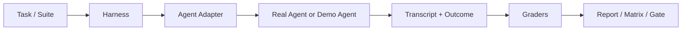

# Claude Agent Eval

[](https://github.com/ErenYegar/claude-agent-eval/actions/workflows/demo-eval.yml)
[](./LICENSE)
[](https://nodejs.org/)

## Quick Links

- License: [Apache-2.0](./LICENSE)
- CI: [Demo Eval CI](https://github.com/ErenYegar/claude-agent-eval/actions/workflows/demo-eval.yml)
- Community:
  [Contributing](./CONTRIBUTING.md)
  [Roadmap](./ROADMAP.md)
  [Changelog](./CHANGELOG.md)
- Docs:
  [工具构建全过程](./docs/agent-eval-tool-build-process.zh-CN.md)
  [评测 Claude Code 项目全过程](./docs/agent-eval-claude-code-evaluation-process.zh-CN.md)
- Quick Start:
  `npm run demo`
  `npm run demo:matrix`
  `node .\agent_eval\cli.js inspect --report .\reports\demo-report.json --failed-only`

## Project Preview



一个基于 Anthropic 文章 [Demystifying evals for AI agents](https://www.anthropic.com/engineering/demystifying-evals-for-ai-agents) 实现的 Agent 评测工具。

这个项目的目标不是做一个“单次问答打分器”，而是做一套更贴近真实 Agent 工程实践的 eval harness。它把文章里的 `task / trial / transcript / outcome / grader / suite / harness` 都落成了可运行代码，并支持：

- capability eval
- regression eval
- transcript 记录与失败复盘
- 文件级 / JSON 级 / shell 级 grader
- 本地模块、stdio、HTTP、Claude Code CLI 多种 agent 接入方式
- matrix 批量执行与 CI gate

## 仓库结构

```text
agent_eval/   核心执行器、adapter、report、matrix
examples/     示例 agent、suite、Claude Code 配置、matrix 配置
reports/      本地生成的评测报告（默认不提交到 Git）
docs/         中文过程文档
```

## 核心能力

### 1. 结构化评测模型

- `task`：单个任务，包含 prompt、环境和 graders
- `trial`：同一任务的一次执行
- `transcript`：完整执行轨迹
- `outcome`：最终输出、状态、cwd、耗时
- `suite`：一组 capability 或 regression 任务
- `matrix`：多套 suite 的批量运行入口

### 2. 多种 grader

当前支持：

- `exact_output`
- `contains_keywords`
- `tool_usage`
- `state_assertion`
- `transcript_limits`
- `file_exists`
- `file_not_exists`
- `file_contains`
- `file_content_assertion`
- `file_equals`
- `json_file_assertion`
- `shell_assertion`

### 3. 多种 agent 接法

支持：

- 本地 JS 模块
- 语言无关的 stdio RPC 进程
- HTTP 服务
- Claude Code CLI

## 快速开始

本项目零依赖即可运行核心示例，只需要本机有 Node.js。

### 运行 demo suite

```powershell
node .\agent_eval\cli.js run --suite .\examples\demo_suite.js --agent .\examples\demo_agent.js --trials 5 --out .\reports\demo-report.json
```

### 运行 demo matrix 并作为 gate

```powershell
node .\agent_eval\matrix.js --matrix .\examples\demo_eval_matrix.js --out-dir .\reports\demo-matrix --fail-on-gate
```

### 查看失败样本

```powershell
node .\agent_eval\cli.js inspect --report .\reports\demo-report.json --failed-only
```

## Claude Code 真实评测

这个仓库还包含一套针对 Claude Code 2.1.88 的真实评测配置与 suite，包括：

- capability suite
- standard regression suite
- repo-grounded regression suite
- eval matrix

对应文件位于：

- `examples/claude_code_agent.config.json`
- `examples/claude_code_repo_agent.config.json`
- `examples/claude_code_capability_suite.js`
- `examples/claude_code_regression_suite.js`
- `examples/claude_code_repo_grounded_suite.js`
- `examples/claude_code_eval_matrix.js`

示例命令：

```powershell
node .\agent_eval\cli.js run --suite .\examples\claude_code_capability_suite.js --agent .\examples\claude_code_agent.config.json --out .\reports\claude-code-report.json
```

```powershell
node .\agent_eval\cli.js run --suite .\examples\claude_code_regression_suite.js --agent .\examples\claude_code_agent.config.json --out .\reports\claude-code-regression-report.json
```

```powershell
node .\agent_eval\cli.js run --suite .\examples\claude_code_repo_grounded_suite.js --agent .\examples\claude_code_repo_agent.config.json --out .\reports\claude-code-repo-grounded-report.json
```

```powershell
node .\agent_eval\matrix.js --matrix .\examples\claude_code_eval_matrix.js --out-dir .\reports\claude-code-matrix --fail-on-gate
```

## GitHub Actions 说明

仓库内已经带了一个 GitHub Actions 工作流：

- `.github/workflows/demo-eval.yml`

它默认做两件事：

1. 运行 demo suite
2. 运行 demo matrix gate

这样做的原因是：

- demo 评测不依赖外部模型额度
- demo 评测不依赖你的本地 Claude Code 源码目录
- 它适合在 GitHub Hosted Runner 上稳定执行

### 为什么 Actions 默认不跑真实 Claude Code 评测

真实 Claude Code 评测依赖：

1. 本地或 self-hosted 环境中的 Claude Code CLI
2. 真实可访问的目标源码目录
3. 可用的模型额度 / 账号状态

因此，这部分更适合：

- 在本地运行
- 在 self-hosted runner 上运行
- 或者在你未来补齐凭据与运行环境后再扩展工作流

## package.json 脚本

当前提供：

```powershell
npm run demo
npm run demo:matrix
npm run ci:demo
```

## 过程文档

仓库中还包含两份详细中文文档：

- [工具构建全过程](./docs/agent-eval-tool-build-process.zh-CN.md)
- [评测 Claude Code 项目全过程](./docs/agent-eval-claude-code-evaluation-process.zh-CN.md)

## 适合继续扩展的方向

- 增加更多 repo-grounded 任务
- 为报告增加历史趋势对比
- 增加更细粒度的行为级 grader
- 为 self-hosted 环境增加真实 Claude Code CI 工作流

## Public Repo Setup

为避免公开仓库泄露本地目录结构，Claude Code 相关示例通过环境变量注入本地路径，而不是把绝对路径写进仓库。

```powershell
$env:CLAUDE_CODE_CLI_PATH="D:\path\to\claude-code\package\cli.js"
$env:CLAUDE_CODE_REPO="D:\path\to\claude-code-repo"
$env:AGENT_EVAL_WORKSPACE_ROOT=".\eval_workspaces"
```

- `CLAUDE_CODE_CLI_PATH` 指向 Claude Code 的 `package/cli.js`

- `CLAUDE_CODE_REPO` 指向被评测的 Claude Code 源码仓库

- `AGENT_EVAL_WORKSPACE_ROOT` 指向评测临时工作区根目录；不设置时默认是 `./eval_workspaces`

- `.env.example` 提供了这三个变量的模板

- `reports/` 视为本地生成产物，示例命令仍会写入这里，但默认不会提交到 Git
## License

This project is licensed under the Apache License 2.0.

See the [LICENSE](./LICENSE) file for details.
